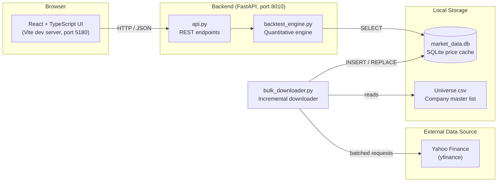
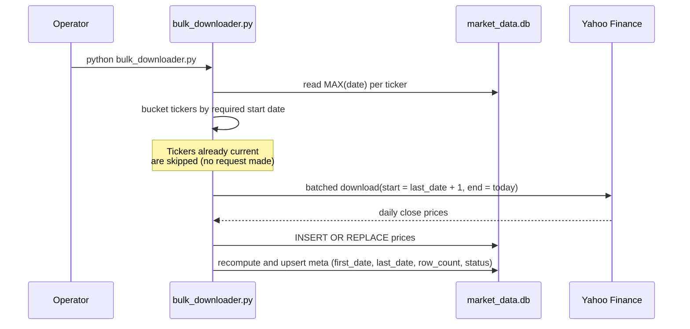

# Portfolio Terminal

A self-hosted portfolio backtesting terminal for the Indian equity market (NSE/BSE). It lets you construct a custom-weighted, multi-asset portfolio, backtest it against the Nifty 50 benchmark over configurable horizons, and inspect the results through a terminal-style web interface.

The project is split into two independently runnable services: a FastAPI backend that owns the data cache and the quantitative engine, and a React/TypeScript frontend that renders the portfolio construction and results UI.

## Table of Contents

- [Overview](#overview)
- [Key Features](#key-features)
- [Architecture](#architecture)
- [Data Pipeline](#data-pipeline)
- [Tech Stack](#tech-stack)
- [Project Structure](#project-structure)
- [Getting Started](#getting-started)
  - [Prerequisites](#prerequisites)
  - [Backend Setup](#backend-setup)
  - [Frontend Setup](#frontend-setup)
  - [Running Both Together](#running-both-together)
- [Keeping the Data Fresh](#keeping-the-data-fresh)
- [API Reference](#api-reference)
- [Command-Line Usage](#command-line-usage)
- [Design Notes](#design-notes)
- [License](#license)

## Overview

Portfolio Terminal answers a simple question: "If I had invested a fixed amount into this basket of stocks, with these weights, on this date, how would it have performed against the market?"

It is built around a local SQLite cache of daily closing prices, so that constructing and re-running backtests is instantaneous and never blocked on a live market-data API call. The cache itself is refreshed independently via an incremental downloader, decoupling data acquisition from computation.

## Key Features

- **Custom weighted portfolios** — select any combination of NSE/BSE-listed companies and assign arbitrary weights (must sum to 100%).
- **Configurable rebalancing** — buy-and-hold, daily, monthly, or quarterly constant-mix rebalancing, computed with frictionless (no transaction cost) share tracking.
- **Fixed-horizon performance** — point-to-point returns and CAGR at 3M, 6M, 12M, 3Y, and 5Y horizons, benchmarked against the Nifty 50.
- **Per-asset contribution breakdown** — standalone return and weighted contribution to portfolio return for every holding, at every horizon.
- **Local price cache** — all backtests read from a local SQLite database; no network calls happen during a run.
- **Incremental data refresh** — the downloader tops up only the missing trading days on every re-run instead of re-fetching full history.
- **NSE-first, BSE-fallback ticker resolution** — every company is downloaded via its NSE ticker where available, with automatic fallback to its BSE ticker if NSE data is unavailable.
- **Terminal-style UI** — dark/light theme toggle, live ticker search, and chart/metrics views built with Recharts.

## Architecture



The backend is strictly layered: `api.py` contains no business logic and only adapts HTTP requests into calls against `backtest_engine.py`, which in turn never talks to the network — it only reads from the SQLite cache. Data acquisition is a separate, manually or periodically triggered process (`bulk_downloader.py`).

## Data Pipeline

The database is populated and kept current by `bulk_downloader.py`, which is safe to re-run on any cadence (daily, weekly, or ad hoc):



Each company is first attempted through its NSE ticker (`.NS`). If that fails, the pipeline falls back to the same company's BSE ticker (`.BO`); companies with no NSE listing at all are downloaded directly via BSE. All price rows are ultimately keyed in the database under the company's canonical ticker, regardless of which exchange actually supplied the data.

## Tech Stack

| Layer          | Technology                                  |
|----------------|----------------------------------------------|
| Frontend       | React 18, TypeScript, Vite, Tailwind CSS, Recharts, lucide-react |
| Backend        | Python, FastAPI, Uvicorn, Pydantic           |
| Data Layer     | SQLite, pandas, NumPy                        |
| Market Data    | yfinance (Yahoo Finance)                     |
| Tooling        | oxlint (frontend linting)                    |

## Project Structure

```
Portfolio Backtester/
├── backend/
│   ├── api.py                 FastAPI application (HTTP layer only)
│   ├── backtest_engine.py     Data loading, cleaning, and quantitative engine
│   ├── bulk_downloader.py     Incremental price downloader (NSE-first, BSE-fallback)
│   ├── download_bse_only.py  Targeted downloader for BSE-only listed companies
│   ├── Universe.csv           Master list of companies (name, BSE/NSE codes, market cap)
│   ├── market_data.db          Local SQLite price cache (generated, not committed)
│   ├── requirements.txt       Backend Python dependencies
│   └── run.bat                 Backend launch script (Windows)
├── frontend/
│   ├── src/
│   │   ├── App.tsx             Root application component
│   │   ├── api.ts               API client for the backend
│   │   ├── types.ts             Shared TypeScript types
│   │   └── components/         Header, TerminalControls, HorizonChart, MetricsGrid
│   ├── package.json
│   └── run.bat                 Frontend launch script (Windows)
├── start.bat                    Launches backend and frontend together
├── stop.bat / stop.ps1          Stops both services
└── README.md
```

## Getting Started

### Prerequisites

- Python 3.11 or later
- Node.js 18 or later
- npm

### Backend Setup

```bash
cd backend
python -m venv venv

# Windows
venv\Scripts\activate

# macOS/Linux
source venv/bin/activate

pip install -r requirements.txt
```

Populate the local price cache before running your first backtest:

```bash
python bulk_downloader.py
```

This reads `Universe.csv` and downloads five years of daily closing prices for every listed company plus the Nifty 50 benchmark into `market_data.db`. Depending on universe size, the initial run can take several minutes; subsequent runs are incremental and much faster (see [Keeping the Data Fresh](#keeping-the-data-fresh)).

Start the API server:

```bash
uvicorn api:app --reload --port 8010
```

The backend will be available at `http://localhost:8010`.

### Frontend Setup

```bash
cd frontend
npm install
npm run dev -- --port 5180
```

The UI will be available at `http://localhost:5180`.

### Running Both Together

On Windows, `start.bat` in the project root launches both services in minimized windows and opens the UI in your default browser:

```bash
start.bat
```

Use `stop.bat` (or `stop.ps1`) to shut both services down.

## Keeping the Data Fresh

`bulk_downloader.py` is designed to be re-run repeatedly without re-downloading history it already has:

- On each run, it checks the latest stored date per ticker directly in `market_data.db`.
- Tickers are only fetched from `last_date + 1` onward; tickers whose data is already current are skipped entirely, with no network request made.
- Tickers that have never been downloaded still receive the full five-year backfill.
- Historical statistics in the `meta` table (`first_date`, `last_date`, `row_count`) are recomputed from the full price history on every write, so an incremental run never regresses previously stored data.

```bash
cd backend
python bulk_downloader.py
```

Re-running this on a schedule (daily, after market close, is a reasonable cadence for NSE/BSE) keeps the cache current with minimal bandwidth and runtime cost.

To add new companies to the universe, add a row to `Universe.csv` (`Name`, `BSE Code`, `NSE Code`, `Market Capitalization`) and re-run the downloader; existing tickers are unaffected.

## API Reference

All endpoints are served under `http://localhost:8010`.

| Method | Endpoint          | Description                                                        |
|--------|-------------------|----------------------------------------------------------------------|
| GET    | `/api/health`     | Liveness check; returns service status and current timestamp.        |
| GET    | `/api/tickers`    | Returns the available ticker universe, optionally filtered by `search`. |
| POST   | `/api/backtest`   | Runs a backtest for a given portfolio and returns the wealth timeline, horizon returns, and per-asset breakdown. |

### `POST /api/backtest` request body

```json
{
  "weights": { "TCS.NS": 30, "RELIANCE.NS": 40, "HDFCBANK.NS": 30 },
  "start_date": "2022-01-01",
  "rebalance_frequency": "monthly",
  "initial_investment": 100000
}
```

- `weights` — ticker to weight mapping, expressed as a percentage; must sum to 100.
- `start_date` — backtest start date (`YYYY-MM-DD`); the nearest actual trading day on or after this date is used.
- `rebalance_frequency` — one of `null`, `"daily"`, `"monthly"`, `"quarterly"`.
- `initial_investment` — starting capital in rupees.

## Command-Line Usage

The backend also exposes a standalone CLI for running backtests without the frontend:

```bash
cd backend

# List the full available ticker universe
python backtest_engine.py --list

# Search for a company or ticker
python backtest_engine.py --search "reliance"

# Run a backtest
python backtest_engine.py --tickers "RELIANCE.NS:0.5,TCS.NS:0.5" --start 2023-01-01 --rebalance monthly
```

## Design Notes

- The backtest engine forward-fills, then back-fills, gaps in the price series to reconcile holiday and listing-date mismatches across assets before any calculation is performed.
- Rebalancing is modeled without transaction costs or taxes; buy-and-hold tracks a fixed number of shares purchased once, while daily/monthly/quarterly modes periodically reset the portfolio back to its target weights at the prevailing price.
- Horizons that extend beyond the available cached data (or into the future) are reported as unavailable rather than silently truncated or extrapolated.

## License

This project does not currently declare a license. All rights reserved by the author unless a license file is added.
